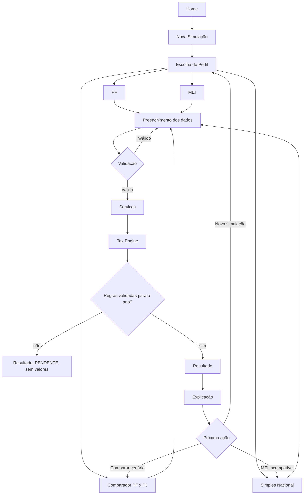
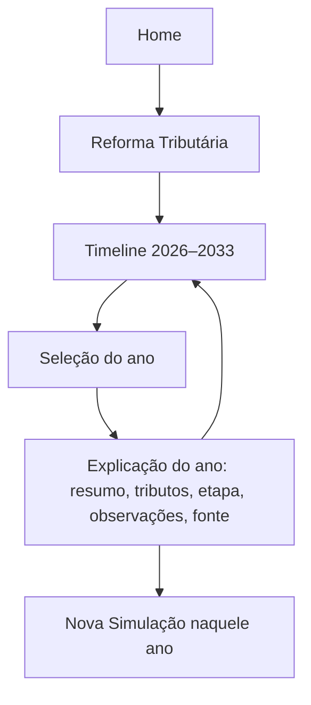
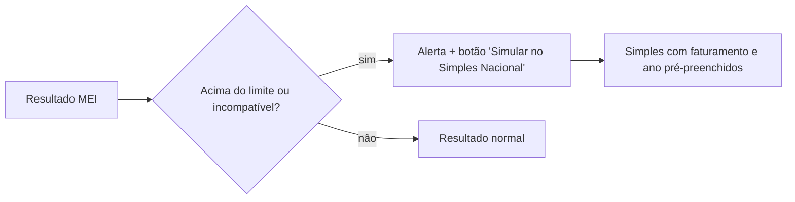
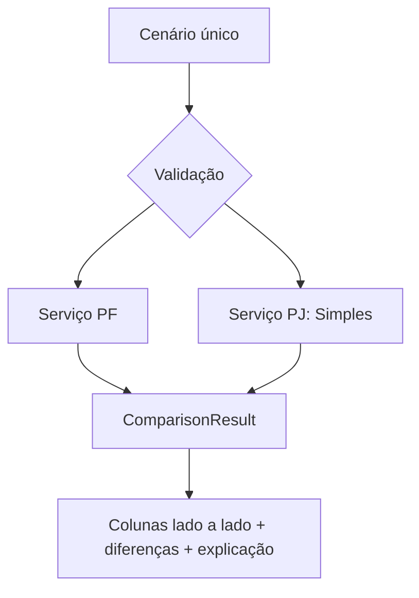

# Fluxos do Usuário

> **Status posterior (MVP final):** fluxos da especificação, preservados como histórico. Na versão entregue: o fluxo principal funciona (escolha → formulário → `POST /resultado` → resultado), mas o ramo "MEI → Simples com dados pré-preenchidos" (seção 3) **não foi implementado** (o MEI exibe o resultado ou a mensagem de não suportado); o comparador (seção 4) usa um formulário único e exibe PF e PJ lado a lado, com diferenças mensais (não há diferença anual nem gráfico); o resultado de ano sem regra não é alcançável pela interface, que opera em 2026. Ver [relatório acadêmico](../academic/relatorio-final.md).

## 1. Fluxo principal de simulação

## 2. Fluxo da Reforma Tributária

## 3. Fluxo MEI → Simples

## 4. Fluxo Comparador

## Navegação global
Cabeçalho: Home · Simulações · Reforma · Sobre. Rodapé com aviso educacional em todas as telas.
